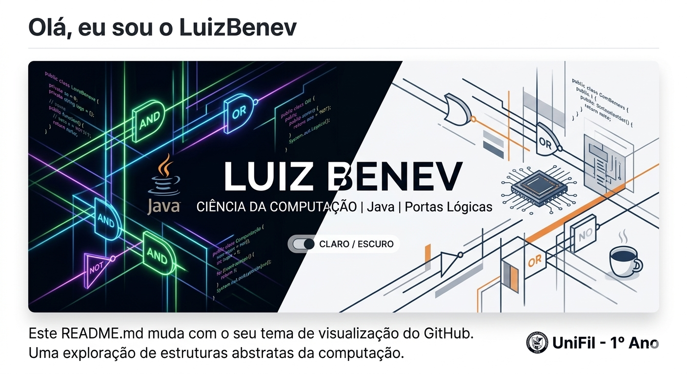

# Olá, eu sou o LuizBenev 👋

  

---

### 🎓 Sobre Mim
Atualmente estou no **1º ano (2º bimestre)** de **Ciência da Computação na UniFil**. Estou a construir a minha base em programação e arquitetura de computadores.

- 🔭 Atualmente a explorar os fundamentos do **Java**.
- ⚙️ A estudar **Circuitos Lógicos** e **Portas Lógicas** (AND, OR, NOT...).
- 💻 Utilizo o **IntelliJ IDEA** como ferramenta principal.
- 🎯 Objetivo: Compreender como o software comunica com o hardware.

---

### 🛠️ Tecnologias e Ferramentas

  
  
  

---

### 📊 Estatísticas do GitHub (Links Estáveis)

  
  
  

  

---

### 📫 Como me encontrar

