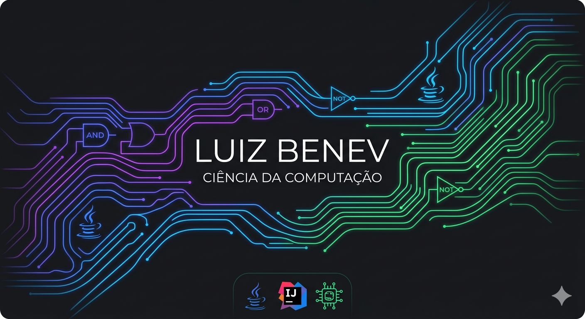

# Olá, eu sou o LuizBenev 👋

  

---

### 🎓 Sobre Mim
Estudante de **Ciência da Computação na UniFil** (1º Ano). Focado na intersecção entre a lógica pura do hardware e o poder do Java.

- ☕ **Java:** Desenvolvendo algoritmos e estruturas de dados no IntelliJ.
- ⚡ **Hardware:** Explorando portas lógicas e arquitetura de processadores.

---

### 🛠️ Tecnologias

  
  
  

---

### 📊 Desenvolvimento e Contato

  
  
  

  

